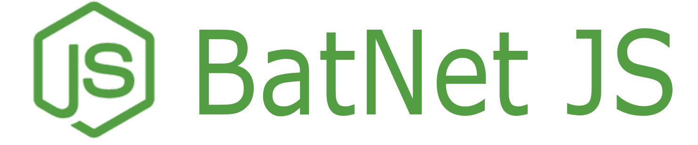
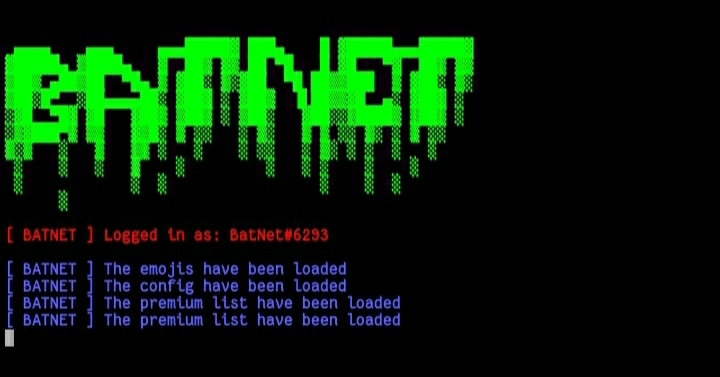

<div align="center">
    
    <p><i>A powerful Discord Raid Bot written in Node.JS</i></p>
    <h5><a href="https://discord.gg/QqSds9fVwR">Discord</a></h5>
</div>
<hr>
<div align="center">
    
    
    
</div>

<hr>
<h3>Features:</h3>
<p>• Blacklist</p>
<p>• Premium list</p>
<p>• Logging system</p>
<p>• Custom emojis</p>
<p>• 15 Commands</p>
<hr>
<h3>Installation</h3>
<p>• Node.js</p>
<p>• Discord.js v12</p>
<p>• Chalk v4</p>
<p>• Node fetch v2</p>
<hr>
<h3>Screenshot</h3>

<hr>
<h3>Setup</h3>
<p>To setup the bot, go to <i>config.json</i> and <i>ignore.json</i> and set the bot's configuration</p>
<h4>Example</h4>
<p><code>config.json</code></p>

```json
{
     "token": "TOKEN HERE",
     "prefix": "PREFIX HERE"
}
```

<p><code>ignore.json</code></p>

```json
{
     "server_name": "SERVER NAME",
     "nuke_channel": "NUKE CHANNEL",
     "raid_channel": "RAID CHANNEL",
     "webhook_url": "WEBHOOK",
     "server_logo": "SERVER LOGO",
     "role_name": "ROLE NAME"
}
```

<hr>
<h3>Special Mentions</h3>
<h4><a href="https://github.com/Lierx">Lierx</a></h4>
<p>• Fixed bugs</p>
<p>• Helped with the original source</p>
